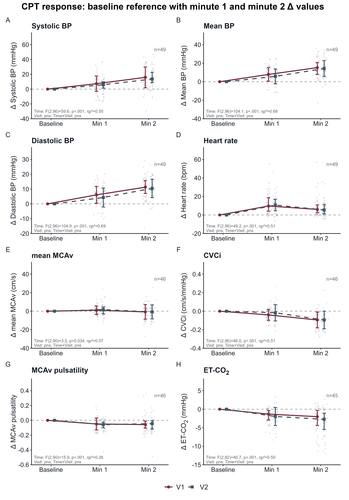
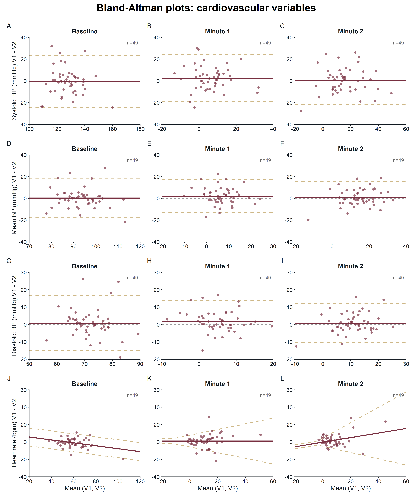
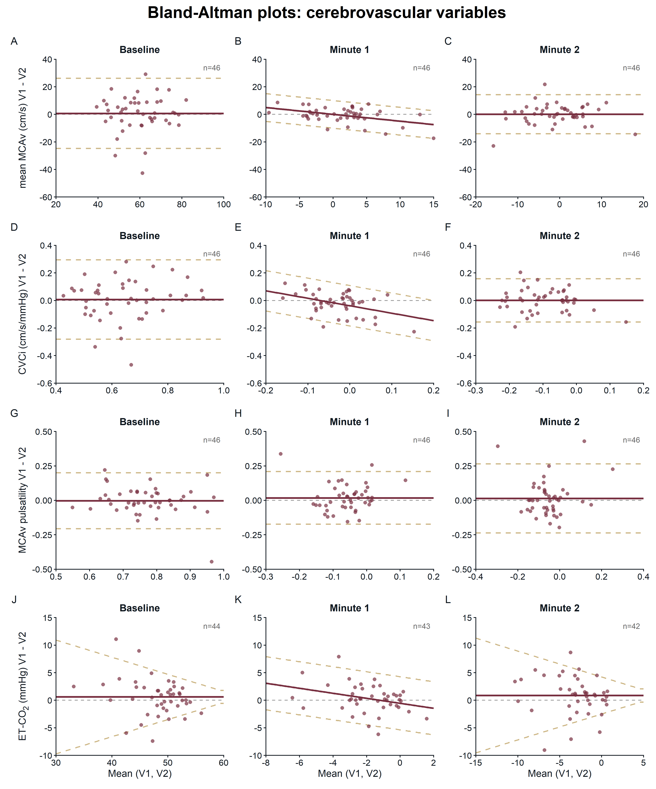
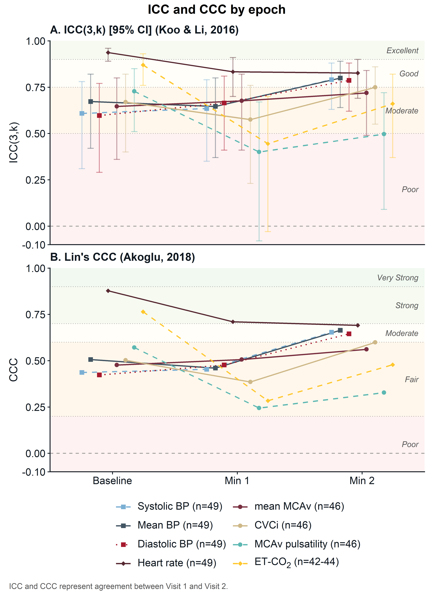
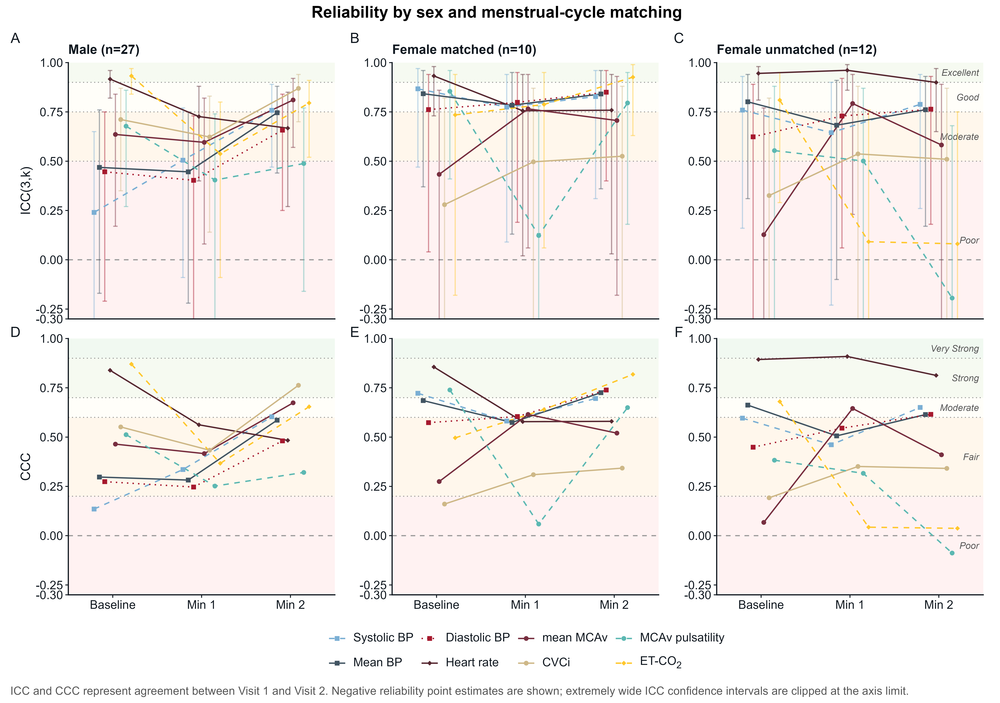
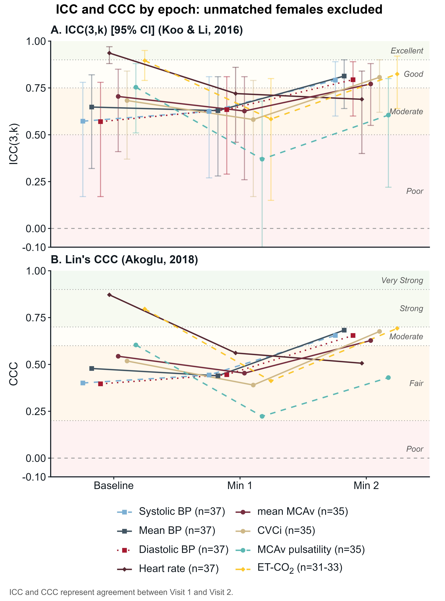
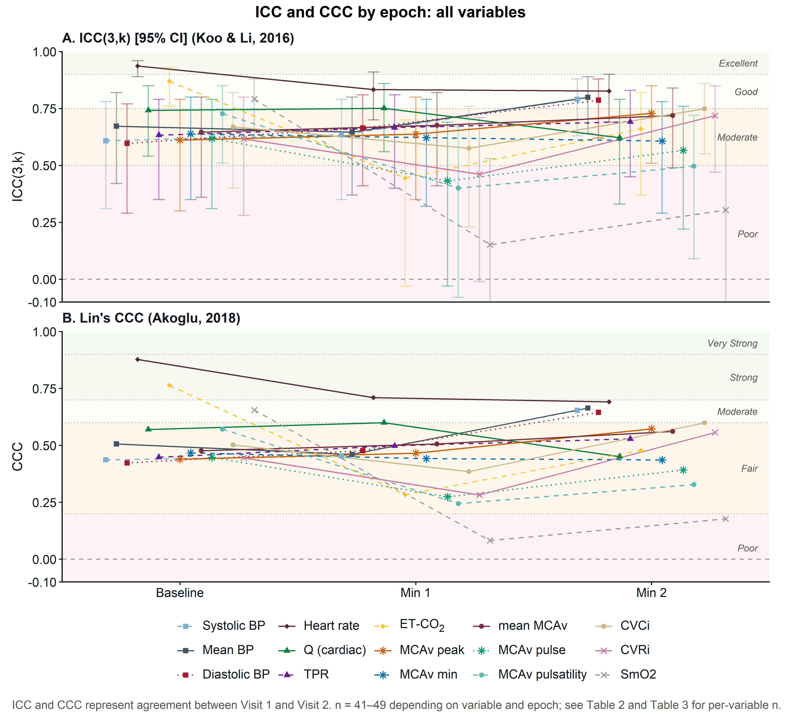

# TCD Reproducibility Analysis

Reproducible analysis for the between-visit reproducibility of cerebrovascular and cardiovascular responses during the cold pressor test (CPT).

---

## Overview

This repository contains the code and generated manuscript-ready figures/tables reported in:

> Vondrasek JD, Hoch JW, Huang M, Belval LN, Jarrard CP, Crandall CG, Watso JC. *Between-visit Reproducibility of Cerebrovascular and Cardiovascular Reactivity During the Cold Pressor Test*. American Journal of Physiology-Heart and Circulatory Physiology. Under review.

The analysis evaluates visit-to-visit agreement for baseline values and CPT-evoked responses across cardiovascular and cerebrovascular variables.

---

## Objectives

### Aim 1 - CPT response time course

Summarize visit 1 and visit 2 changes from baseline at minute 1 and minute 2 of CPT for key cardiovascular and cerebrovascular variables.

Reported outputs: time-course figure, mean and standard error summaries, and repeated-measures ANOVA results for time, visit, and time-by-visit effects.

### Aim 2 - Between-visit agreement

Quantify reproducibility for baseline values and CPT responses using agreement and reliability statistics.

Reported metrics: Bland-Altman bias and limits of agreement, intraclass correlation coefficient (ICC), concordance correlation coefficient (CCC), paired comparisons, and effect sizes.

### Aim 3 - Sensitivity analyses

Evaluate whether reliability estimates are influenced by sex, menstrual-cycle matching, unmatched female participants, and leave-one-out subject influence.

Reported outputs: subgroup reliability figures, exclusion sensitivity figure, and leave-one-out influence tables.

### Table 1 - Participant characteristics

Summarize demographic and anthropometric characteristics for the analytic sample.

---

## Repository Structure

```text
.
|-- B_Revised_Figures/
|   |-- 06_minute_level_revisions.ipynb
|   |-- build_minute_level_outputs.py
|   |-- Fig1_CPT_TimeCourse.png
|   |-- Fig2_BA_Cardiovascular.png
|   |-- Fig3_BA_Cerebrovascular.png
|   |-- Fig4_ICC_CCC_Summary.png
|   |-- Fig5_ICC_CCC_Sex_Menstrual.png
|   |-- Fig6_ICC_CCC_Exclude_Unmatched_Females.png
|   |-- SupFig_ICC_CCC_AllVars.png
|   |-- Table1_Characteristics.csv
|   |-- Table2_Baseline_All15_Reliability.csv
|   |-- Table3_Min1_Min2_All15_Reliability.csv
|   `-- SupplementaryTable_*.csv
|-- data/
|   `-- raw/
|       `-- .gitkeep
|-- scripts/
|   `-- sync_revised_outputs.ps1
|-- requirements.txt
|-- LICENSE
|-- .gitignore
`-- README.md
```

---

## Data Requirements

Raw data are not included in this repository.

To rerun the full analysis, place the private source workbooks in `data/raw/` or point the environment variables below to the folder that contains them.

Required input files:

| File | Purpose |
|---|---|
| `CPT Data_visit split.xlsx` | Main paired visit dataset |
| `CPT_ETCO2_Resp_Comparison.xlsx` | ET-CO2 patch/comparison workbook |

Expected workbook sheets:

| Workbook | Sheet |
|---|---|
| `CPT Data_visit split.xlsx` | `Data` |
| `CPT_ETCO2_Resp_Comparison.xlsx` | `ETCO2_Resp_Comparison` |

The main workbook is expected to contain participant identifiers, subject IDs, sex/group variables, and visit-specific baseline and CPT delta columns for the cardiovascular and cerebrovascular variables analyzed in `build_minute_level_outputs.py`.

> Note: The raw workbooks are excluded from Git to protect private participant-level data. Please contact the corresponding author to request access.

---

## Quick Start

### 1. Clone the repository

```bash
git clone https://github.com/Jonathan-Hoch/analysis-TCD-reproducibility.git
cd analysis-TCD-reproducibility
```

### 2. Install Python dependencies

```bash
pip install -r requirements.txt
```

### 3. Add the private data

Place the required workbooks in `data/raw/`, or set environment variables to their current private location.

PowerShell example:

```powershell
$env:TCD_DATA_DIR = "$PWD\data\raw"
$env:TCD_OUTPUT_DIR = "$PWD\B_Revised_Figures"
python B_Revised_Figures\build_minute_level_outputs.py
```

You can also provide explicit workbook paths:

```powershell
$env:TCD_MASTER_XLSX = "C:\path\to\CPT Data_visit split.xlsx"
$env:TCD_ETCO2_XLSX = "C:\path\to\CPT_ETCO2_Resp_Comparison.xlsx"
python B_Revised_Figures\build_minute_level_outputs.py
```

### 4. Run from Jupyter

Open `B_Revised_Figures/06_minute_level_revisions.ipynb` and run all cells from top to bottom.

---

## Methods Summary

### Time-course analysis

- Baseline is treated as the zero-reference for delta responses.
- Minute 1 and minute 2 CPT responses are analyzed from visit-specific delta columns.
- Repeated-measures ANOVA is used to test time, visit, and time-by-visit effects.

### Agreement and reliability

| Analysis | Purpose |
|---|---|
| Bland-Altman statistics | Estimate visit 2 minus visit 1 bias and limits of agreement |
| ICC | Quantify between-visit reliability |
| CCC | Quantify between-visit concordance |
| Paired comparisons | Test systematic visit differences |
| Leave-one-out analysis | Identify influential participants for reliability estimates |

### Sensitivity analyses

- Reliability is summarized for all participants and by sex/menstrual-cycle matching groups.
- A sensitivity analysis excludes unmatched female participants.
- Variable-specific exclusions are implemented in the analysis script for prespecified artifacts or missingness.

---

## Figures

### Figure 1 - CPT response time course



### Figure 2 - Cardiovascular Bland-Altman plots



### Figure 3 - Cerebrovascular Bland-Altman plots



### Figure 4 - ICC and CCC summary



### Figure 5 - Reliability by sex and menstrual-cycle matching



### Figure 6 - Reliability excluding unmatched female participants



### Supplementary Figure - ICC and CCC for all variables



---

## Requirements

- Python 3.10 or newer recommended
- Jupyter Notebook, if running the notebook interface

| Package | Purpose |
|---|---|
| `matplotlib` | Figures |
| `numpy` | Numerical analysis |
| `openpyxl` | Excel workbook import |
| `pandas` | Data manipulation and CSV exports |
| `pingouin` | ICC and reliability statistics |
| `scipy` | Statistical tests |
| `statsmodels` | Repeated-measures ANOVA and regression models |

---

## Limitations

- Raw participant-level data are not public and must be requested separately.
- Reproducibility estimates are sample-specific and may be sensitive to small subgroup sizes.
- Sex and menstrual-cycle sensitivity analyses should be interpreted cautiously where strata are small.
- Variable-specific artifact exclusions are encoded in the analysis script and should be reviewed before reuse in a different dataset.

---

## Citation

If you use this code, please cite the associated manuscript:

> Vondrasek JD, Hoch JW, Huang M, Belval LN, Jarrard CP, Crandall CG, Watso JC. *Between-visit Reproducibility of Cerebrovascular and Cardiovascular Reactivity During the Cold Pressor Test*. American Journal of Physiology-Heart and Circulatory Physiology. Under review.

---

## Contact

Jonathan Hoch - [GitHub](https://github.com/Jonathan-Hoch)
